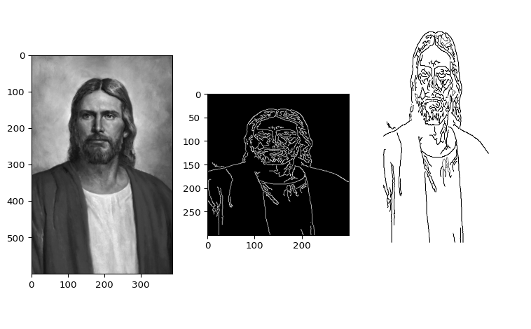

::: {#1176488d .cell fig-height='4' fig-width='14' execution_count=1}

::: {.cell-output .cell-output-stdout}
```


```
:::

::: {.cell-output .cell-output-display}
{}
:::

::: {.cell-output .cell-output-stdout}
```
I taught the computer to get the image of Jesus from any pictue of Him
```
:::
:::


```{=html}
<audio autoplay hidden>
  <source src="music.mp3" type="audio/mpeg">
  Your browser does not support the audio element.
</audio>
```
