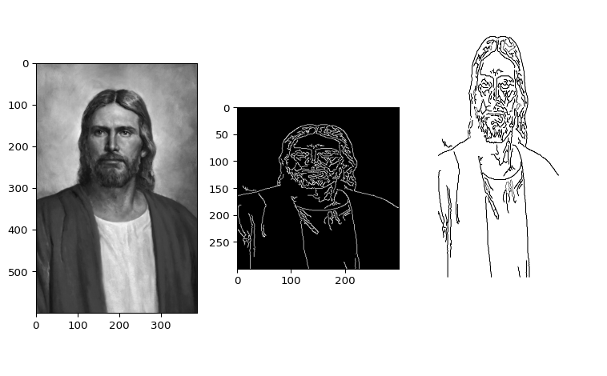

::: {#63696753 .cell fig-height='4' fig-width='14' execution_count=1}

::: {.cell-output .cell-output-stdout}
```
pygame 2.6.1 (SDL 2.28.4, Python 3.13.2)
Hello from the pygame community. https://www.pygame.org/contribute.html
```
:::

::: {.cell-output .cell-output-stdout}
```
I taught the computer to get the image of Jesus from any pictue of Him
```
:::

::: {.cell-output .cell-output-display}
{}
:::
:::


